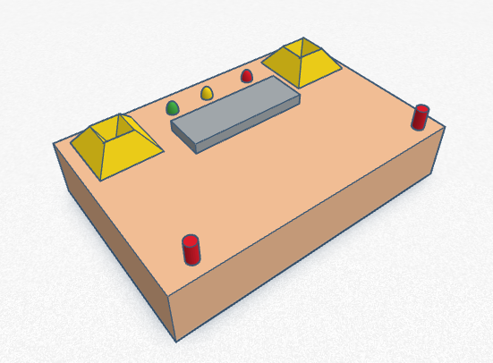
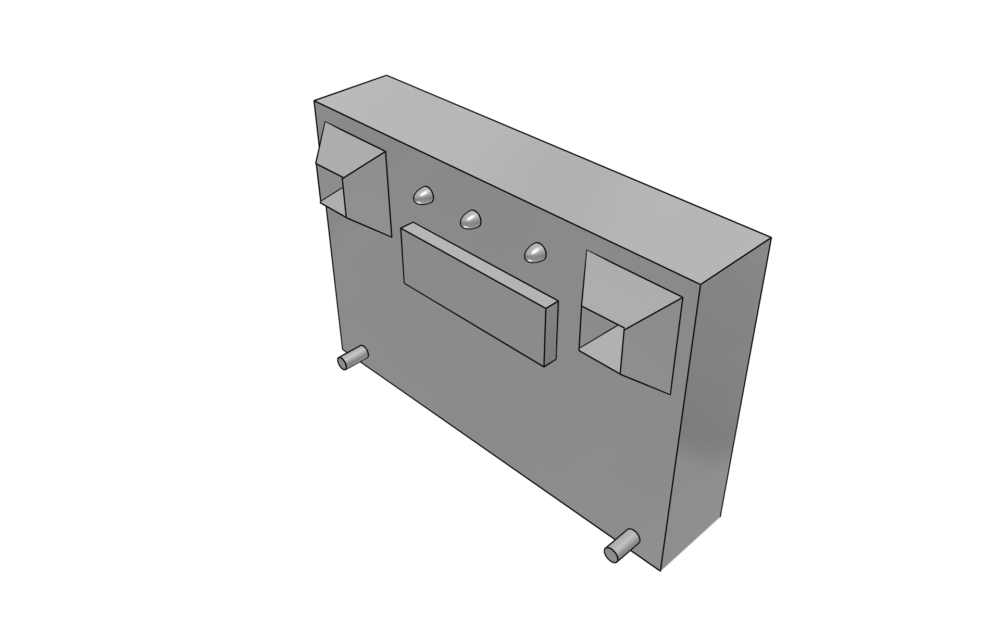
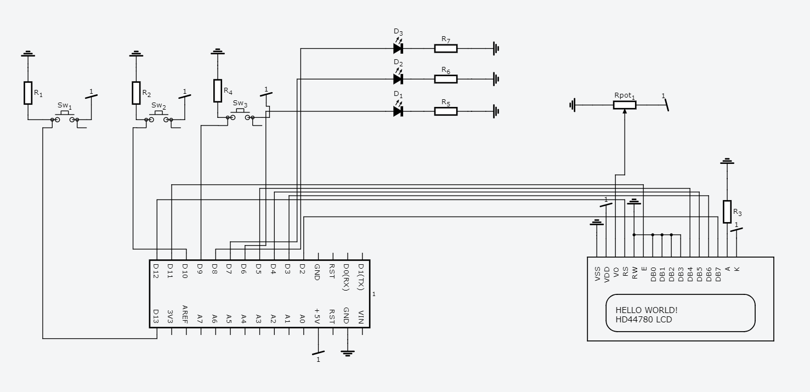
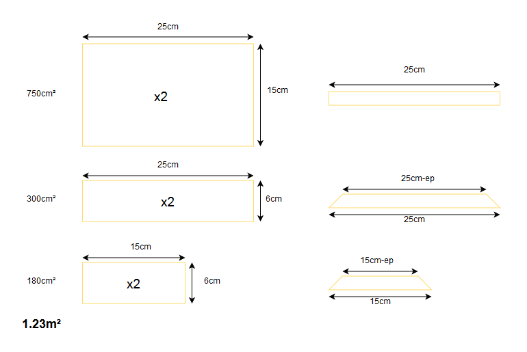

# rubiksTimer

## Présentation du projet

Ce projet a pour but de créer un Chronometre pour rubik's cube permettant de :
* Chronometrer une réalisation
* Générer une sécance de mélange du rubi's cube
* Stocker une liste des meilleurs scores

Voici un apperçu de la conception du projet :

Et le modèle 3D :

## Circuit Arduino

## Construction du boitier

